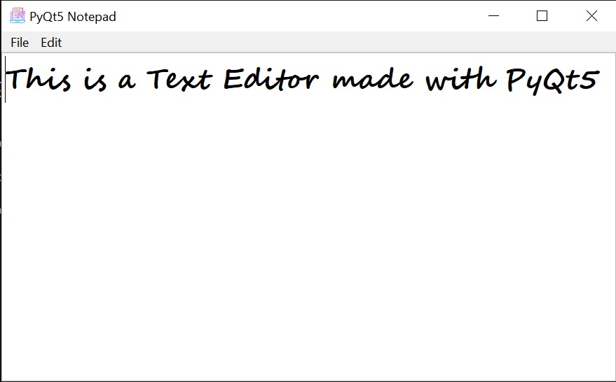

<h1 align="center">
<br>
    ~ PyQt5 Text Editor ~
</h1>


<h3 align="center">A Simple, Minimal Text editor made with PyQt5</h3>
<br>

## Setup and Running the Program

To install the package and all dependencies:

```
git clone https://github.com/mehulsinha73/pyqt5_notepad.git
conda create -n notepad requirements.txt
conda activate notepad
python notepad.py
```

<br>

## Images
<br>

